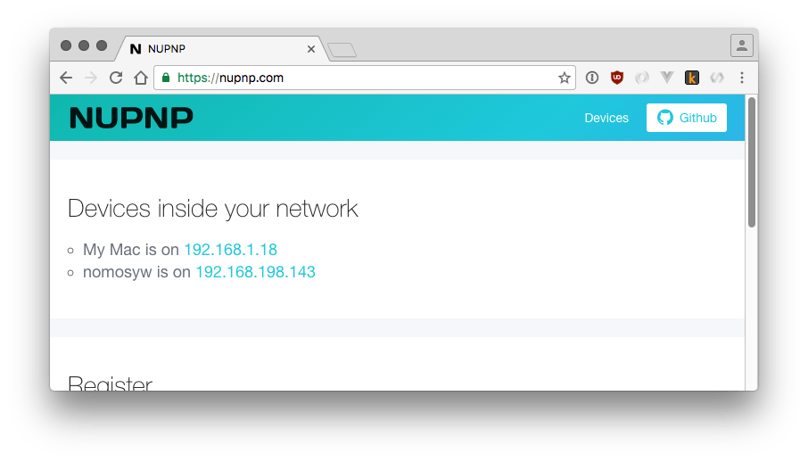

# 🤖 nupnp [](https://www.npmjs.com/package/nupnp)  [](https://david-dm.org/roccomuso/nupnp) [](https://standardjs.com)


Node.js Discovery broker for IoT devices. 🤖



## Install

`npm install nupnp` or `npm install -g nupnp`

## Programmatic usage

#### Server

```javascript
const {Server} = require('nupnp')

let server = new Server({
  port: 8180,
  verbose: true,
  enableProxy: true,
  connectionString: 'sqlite://database.sqlite' // @keyv compatible storage conn. string
}).listen()
  .then(() => console.log(`Server listening on port 8180 - Trust proxy: true`)).catch(console.error)

```

From CLI:

`PORT=8180 VERBOSE=true ENABLE_PROXY=true nupnp &`

If globally installed, it will use by default in-memory storage.
Otherwise pick and install the [keyv adapter](https://github.com/lukechilds/keyv#usage) you like the most (We're using [keyv](https://github.com/lukechilds/keyv) as storage layer).

#### Client

```javascript
const {Client} = require('nupnp')
const os = require('os')

let client = new Client({
  host: 'http://localhost:8180'
})

let iface = os.networkInterfaces().wlp2s0 || os.networkInterfaces().eth0

// register a device
client.register({
  name: 'MyDevice',
  address: iface[0].address, // lan ip
  port: 1234, // optional
  ttl: null // optional
}).then(console.log).catch(console.error)

// get devices
client.getDevices().then(console.log).catch(console.error)
```

## Server API
Register device with:
```
curl -H "Content-Type: application/json" -X POST -d '{"name":"Testdevice","address":"192.168.100.151"}' http://localhost:8180/api/register
```

Optional parameters:
* port
* ttl (in milliseconds)

List device with:
```
http://localhost:8180/api/devices
```

## Inspiration
> After about 1 minute open a web browser and point to find.z-wave.me. Below the login screen you will see the IP address of your RaZberry system. Click on the IP address link to open the configuration dialog.

* http://www.meethue.com/api/nupnp
* http://find.z-wave.me
* http://setup.thinka.eu
* https://github.com/yene/nupnp


## Options

- [x] Trust reverse Proxy
- [x] Support to IPv4 & IPv6

## Security
Never allow another IP address to access the data. Remove the entries after 24h. If you use a proxy prevent external access to the API server.

## Caddy Proxy configuration
```
proxy /api/register localhost:8180 {
        proxy_header X-Forwarded-Proto {scheme}
        proxy_header X-Forwarded-For {host}
        proxy_header X-Real-IP {remote}
        proxy_header Host {host}
}
```

## License

MIT

## Author

Rocco Musolino ([@roccomuso](https://twitter.com/roccomuso))
